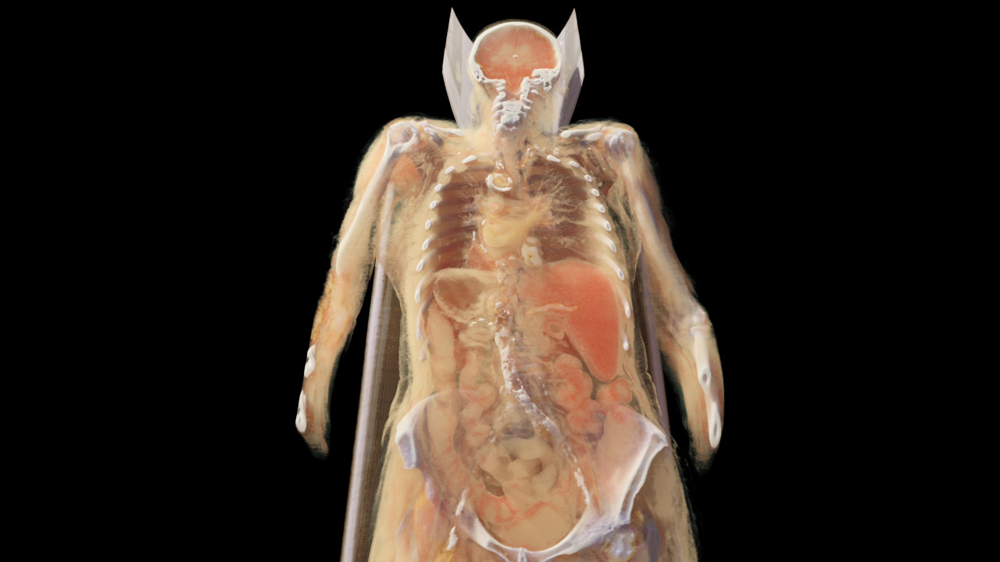
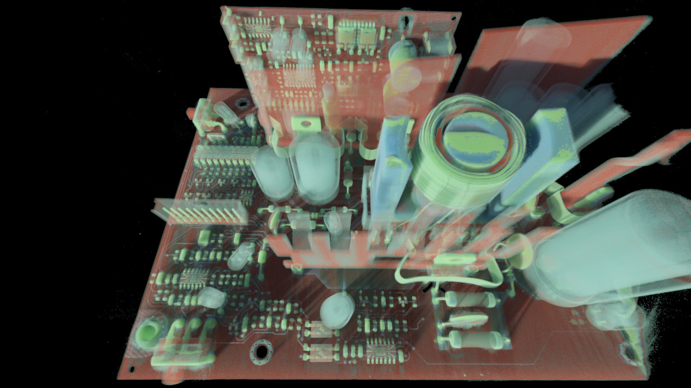
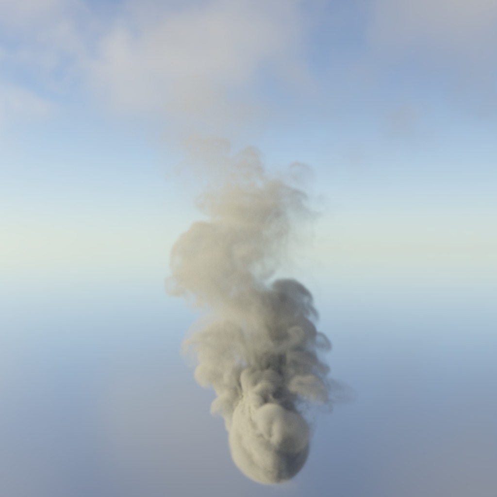
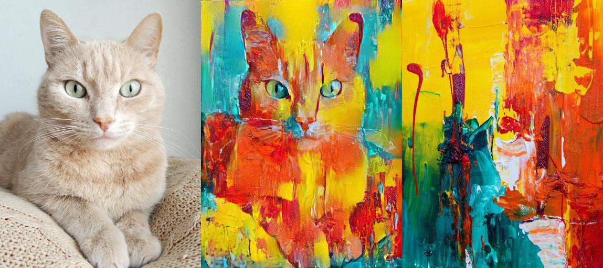

# VolRen

Simple, yet fast OpenGL-based volume path tracer. Supports volumes in isolation lit by a environment map while employing NEE, MIS, RR and a fast volume tracking algorithm published in [Ray Tracing Gems 2](https://link.springer.com/chapter/10.1007/978-1-4842-7185-8_43).
Volumes may be animated and read from OpenVDB, NanoVDB, DICOM or serialized dense or sparse grids. Also supports simple emission and LUT-based transfer functions.

Example rendering of the [Disney cloud](https://www.disneyanimation.com/resources/clouds/) dataset:

# Submodules

Either clone the repository using `--recursive` flag, or run `git submodule update --init --recursive` in the root folder to pull the submodules after cloning.

# Dependencies (Ubuntu)

    apt-get install -y build-essential cmake
    apt-get install -y libx11-dev xorg-dev libopengl-dev freeglut3-dev # OpenGL dependencies
    apt-get install -y libassimp-dev libopenvdb-dev # reduce compile times and enable OpenVDB support
    apt-get install -y python3-dev # for python bindings

# Build

    cmake -S . -B build -DCMAKE_BUILD_TYPE=Release -Wno-dev && cmake --build build --parallel

Currently, only Linux is supported and tested.

# Usage

After building, run the `volren` executable in the root directory. It expects shader source files to be present in `./shader/*`, so make sure to either execute from the root directory or copy the `shader` folder as well when moving the executable.

For command line arguments see the function `init_opengl_from_args()` in `main.cpp` for OpenGL-related arguments and `parse_cmd()` in `main.cpp` for arguments to the renderer. Some example calls are provided below.

In interactive mode, move the camera using the `WASD` and `RFEQ` keys, click and drag the mouse to move the camera and scroll the mousewheel to increase or decrease camera movement speed.
The `F1` key toggles the GUI, where all parameters can also be interactively edited during rendering.
Press `Space` to toggle an animation and `Esc` to terminate the program.

## DICOM grids

While there is basic support to load DICOM volumes via the [Imebra](https://imebra.com/) library, it is impossible to support all of the DICOM standard and you may need to hack the `voldata::DICOMGrid` to fit your needs.
Simple rgba-based transfer functions, as often used in medical rendering contexts, are also supported and can be read from a simple text-based lookup table in the format `%f, %f, %f, %f` per line/entry.

Example rendering of a fullbody CT scan with a transfer function:

## Interactive mode

Start an interactive viewer using the provided volume data and envmap without transfer function:

    ./volren data/smoke.brick data/table_mountain_2_puresky_1k.hdr

Start an interactive viewer using the provided volume data and envmap with transfer function:

    ./volren data/smoke.brick data/table_mountain_2_puresky_1k.hdr data/lut.txt

Example screenshot of an interactive session rendering a explosion cloud from [JangaFX](https://jangafx.com/software/embergen/download/free-vdb-animations/):

Example rendering of an industrial CT scan with a transfer function:

## Offline rendering

Offline render a volume using defaults:

    ./volren data/smoke.brick data/table_mountain_2_puresky_1k.hdr -w 1920 -h 1080 --render

Offline render a volume using some additional command line arguments:

    ./volren data/smoke.brick data/table_mountain_2_puresky_1k.hdr -w 1024 -h 1024 --render --spp 4096 --bounces 128 \
    --albedo 0.8 --phase 0.3 --density 100 --env_strength 3 --env_rot 270 --exposure 3 --gamma 2.0 --cam_fov 40

Expected result of the above command (without alpha channel):

Note that resulting images are saved including alpha to enable blending or masking. Just drop the alpha channel if background color is desired.
If a provided path is a directory, it is assumed to contain discretized grids of a volume animation and all contained volume data will be loaded and rendered in alphanumerical order.
Example public domain volume animation data can be downloaded from [JangxFX](https://jangafx.com/software/embergen/download/free-vdb-animations/), for example.

## Python scripts

For more complex tasks like generating data for ML, see `bindings.cpp` for Python bindings or `scripts/*.py` for some examples.
Note that due to executing python scripts in embedded mode, there is no direct possibility to use arguments for the python scripts, and thus paths and settings need to the provided in the scripts directly. Feel free to add or hack the bindings to your liking.

To setup a python environment using virtualenv:

    virtualenv -p python3 env
    source env/bin/activate
    pip3 install -r scripts/requirements.txt

### COLMAP data generation

Modify `scripts/datagen_colmap.py` to change path to volume data and settings.

    ./volren scripts/datagen_colmap.py --render -w 1024 -h 1024

### DL denoising data generation (using hdf5 in fp16 layout)

Modify `scripts/datagen_denoise.py` to point to your dataset of volume and envmap files.
Creates a randomized HDF5 dataset of noisy and clean image data in fp16 layout. Only color data is exported, but it can easily be extended for auxiliary feature data as well.

    ./volren scripts/datagen_denoise.py --render -w 1024 -h 1024

### Styletransfer

There is a basic styletransfer script using gradient descent on a VGG-based style loss included in `scripts/styletransfer.py`. Look at the beginning of the script for command line arguments. Basic usage is:

    python scripts/styletransfer.py <content_image> <style_image>

Example result using stock photos from [Pexels](https://www.pexels.com/) `python scripts/styletransfer.py imgs/cat.jpg imgs/style.jpg`:

# Licence

This code is under MIT license and freely usable, however note that the [Imebra](https://imebra.com/) submodule of the `voldata` library to support DICOM grids is licenced under GPL.
